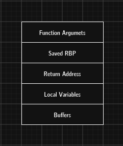
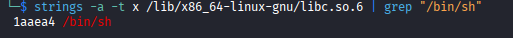

ROP Chains stands for Return Oriented Programming Chains.
It is one of the most powerful exploitation technique in modern offensive engineering. They exist because stack frames contain return addresses and if you can overwrite a return address, you can control execution without injecting new code.
A ROP Chain is a sequence of addresses of existing instructions ( called gadgets ) placed on the stack so that when a program executes RET, it jumps from gadget to gadget, performing attacker controlled operations.
There is no code injections it is about simply reusing code already in the binary or libraries.
This bypasses DEP/NX ( non-executable stack ) because you never execute your own shellcode - you execute their code in your order.
## Why ROP Chains LIve in Stack Frames
Because the Return Addresses are in the stack frame.

## What is a Gadget?
A gadget is a short instruction sequence ending in RET
```
pop rdi; ret
add rax, rdi; ret
mov [rdi], rsi; ret
```
They exists naturally in binaries and libraries ( especially libc)
You find them using tools like :
(i) ROPgadget
(ii) radare2 /R
(iii) objdump -d

## Why ROP Chains Matter
They allow you to:
a) Set registers ( using pop gadgets )
b) Call functions ( like system ("bin/sh")
c) Write memory
d) Read memory
e) Pivot the stack
f) Bypass DEP/NX
g) Bypass ASLR ( with leaks)
h) Achieve full code execution

## Why ROP Chains are the future
Modern systems block:
(i) Executable stacks
(ii) Executable heaps
(iii) Writable code segments
But they cannot return instructions - programs need them and ROP chains exploit this fundamental CPU behavior

1. Compile the vuln.c file and then compile it without the protection.
2. Find system and "/bin/sh" in the binary - use `nm` and `strings`
`nm -D vuln | grep system `
nm -D lists dynamic symbols - functions imported from shared libraries
`strings -a -t x /lib/x86_64-linux-gnu/libc.so.6 | grep "/bin/sh"`

3. Find pop rdi; ret gadget - you can use ROPgadget or radare2
